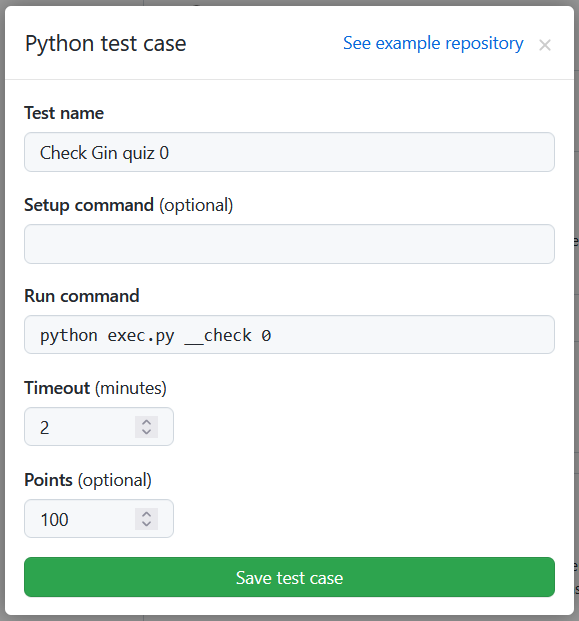
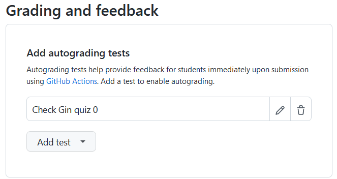

# 如何添加新练习

### 自动打分是如何进行的

自动打分是基于 GitHub Action 进行的，classroom 使用的 action 有一定的格式，如果格式不正确，就算 action 打分通过了，后台也收不到相应信息。

对于具体的练习，我们可能需要一定的环境，让参与者写完的代码能在 github 的容器中跑起来，这时，classroom 默认生成的 action 配置，即 `classroom.yml` 将不再符合我们的需求。我们需要在正式打分前将这个配置覆写，同时 push 到远程使其生效。

覆写的方法可以是引导参与者运行执行覆写操作的脚本，就拿本项目来说，在参与者正式开始答题做练习前，需要在项目根目录运行:

```shell
# GoPracticeGin-template/ 

# 具体仓库名称会因为 classroom 后台的配置而不同，这里只是为了方便说明
python exec.py init 当前练习的id
```
更具体点，以热身练习 [Have a try!](../README.md/#have-a-try) 为例。在练习开始前，引导参与者执行:

```shell
python exec.py init 00
```

如此，我们完成了对于 action 的覆写(具体逻辑请看 [exec.py 第103行](../exec.py))，为后续自动打分的正常运行做好了准备。

对于覆写的具体内容，则是根据当前项目的需要进行的。

拿当前项目来说，初始 action 并不能支持 go 的运行，所以我们添加了

```yml
- uses: actions/setup-go@v3.2.1
  with:
      go-version: 1.19
```

同时，在本项目中，我们使用 python 脚本对完成的练习进行检验(针对本项目检验的逻辑将在[这里](#检验是如何进行的)说明)，所以在这也拉取了 python 的依赖，例如：

```yml
- name: Collect Dependencies
  run: pip3 install requests
```

对于参与者写好的练习(基于 go)，我们将其代码编译，再将可执行文件移到指定的测试环境(其实就是一个隐藏目录:`.checkspace` windows 上是 `_checkspace`)进行测试

```yml
# 编译指定练习，具体是哪一个练习，由 `py exec.py init` 时指定，
# 并由脚本格式化后进行覆写  
- name: Build
  run: |
    mkdir -p .checkspace/ && \
    cd quizzes/quiz{:0>2d}/ && \
    go build -o target && \
    mv target ../../.checkspace/target
  
# 将编译后的结果跑起来，因为当前项目是使用 Gin 的 Web 项目
# 所以需要将后台跑起来，之后运行相应的脚本对这个后台进行测试
- name: Run after build
  run: ./.checkspace/target

# 这里会执行 classroom 后台指定的命令与脚本，我们的测试脚本
# 就是写好、在后台设置好后，使用 classroom 准备好的 action 执行的
- uses: education/autograding@v1
```

### 检验是如何进行的

对于参与者提交的练习，我们通过脚本来进行检测。

我们的项目提供了本地的检验方案，但无论是在本地检验还是直接 push 到远程进行自动打分来检验，所执行的**检验脚本**都是一样的。

就拿 `Have a try!` 这个热身练习来说(相应的检测脚本为 [000.py](./000.py))，我们没有什么特别需要考察的内容，只需要让参与者熟悉操作流程，所以我们可以在后台只设置一个具体的自动打分所依赖的测试，分值 100





而这个测试所采用的脚本，需要有规定的命名(只针对本项目来说)，因为主脚本 [`exec.py`点我前往](../exec.py) 依赖于此

例如 `Hava a try!` 这个练习在第 0 章，classroom 后台只有一个测试，所以是 `000.py` 最后一个零表示第 n-1 个要测试的项目

再比如，第 12 章，后台的第 8 个测试，依赖的脚本名需要为 `128.py`

*注：目前每章支持最多 10 个测试脚本*

### 如何创建新的测试(题目)

以上我们具体梳理了自动打分覆写的具体过程和打分所依赖脚本的执行流程，而针对于此项目，我们不需要从零开始，只需要**设计好题目**，**写好文档**，并**新建文件夹**，**写好测试所用脚本**，**在后台完成测例的添加**就可以了。

模板仓库：[h68u/GoPracticeGin-template](https://github.com/h68u/GoPracticeGin-template)

后台权限申请(需要先加入组织 h68u, 或许应该将当前仓库移交沆助？)：请联系 @sslime336
